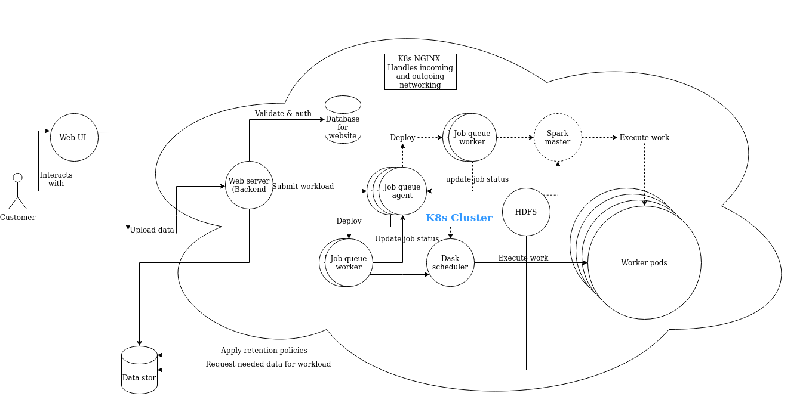

# topiaas
## Architecture

## devenv dependencies 

Make sure to have the following packages installed and configured according to your distribution: 

1. docker (make sure to have your user in docker group. follow this tutorial: https://docs.docker.com/engine/install/linux-postinstall/)
2. minikube 
3. kubectl 

